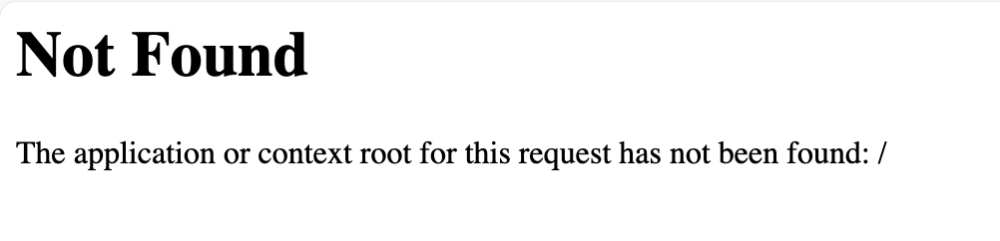

# Introduction
With Maximo Application Suite (MAS) the Manage application uses the context of `maximo` by default. For example, if your MAS base URL is `https://mas.manage.example.apps.mas.sharptree.io/`, the Manage application is available at `https://mas.manage.example.apps.mas.sharptree.io/maximo`. Unfortunately, the default root context, in our example`https://mas.manage.example.apps.mas.sharptree.io/`, does not have an application bound and does not redirect to `maximo` so the user is presented with a `Not Found` error as shown below.

# MAS Maximo Redirect
Fortunately there is a simple solution that can be applied to all deployments using a `postpreprocessor.sh`.

> Before getting into the details, we want to acknowledge that we are building off of [Andrzej Wieclaw's](https://pl.linkedin.com/in/andrzej-wieclaw-733853) excellent post, which can be found here: [https://www.linkedin.com/pulse/ibm-mas-manage-automatic-root-context-redirect-andrzej-wieclaw-v0ogf](https://www.linkedin.com/pulse/ibm-mas-manage-automatic-root-context-redirect-andrzej-wieclaw-v0ogf).  
> His solution works well, but think our approach is more simple and easier to maintain.

The `postpreprocessor.sh` is invoked everytime the deployment image is built and provides an opportunity to modify the image files before the image is deployed. We use this to update each of the deployment `server.xml` files to add a `appOrContextRootMissingMessage` attribute to the `httpDispatcher` element. Detailed documentation for both the `httpDispatcher` and the `appOrContextRootMissingMessage` can be found here: [https://www.ibm.com/docs/en/was-liberty/base?topic=configuration-httpdispatcher](https://www.ibm.com/docs/en/was-liberty/base?topic=configuration-httpdispatcher)

Our implementation of the `postpreprocessor.sh` searches for all the instances of `server.xml` in the `/opt/IBM/SMP/maximo/deployment/was-liberty-default` directory and for each configuration that contains a `httpDispatcher` element, we use `sed` to update it with `appOrContextRootMissingMessage="&lt;script&gt;document.location.href=&quot;/maximo/&quot;;&lt;/script&gt;"`.  This returns a html encoded script that redirects the `document.location` to `/maximo/` when a context root is missing, such as when a user navigates to `https://mas.manage.example.apps.mas.sharptree.io/`.

# Building the Project
The project is a very simple Gradle project using the `distribution` plugin with some extra tasks to unzip/zip the resulting artifact to be compatible with the Maximo customization archive format. To build the project simply run `./gradlew assemble` (linux and mac) or `./gradlew.bat assemble` (windows). The customization archive will be output to the `build/distributions` directory.
