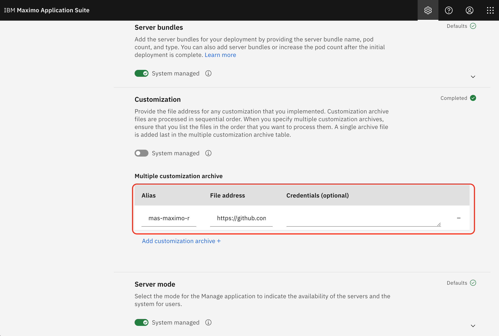
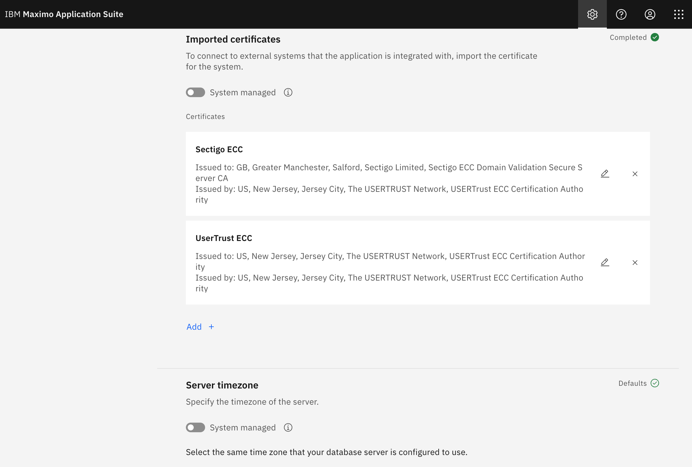

# Introduction
With Maximo Application Suite (MAS) the Manage application uses the context of `/maximo` by default. For example, if your MAS base URL is `https://mas.manage.example.apps.mas.sharptree.io/`, the Manage application is available at `https://mas.manage.example.apps.mas.sharptree.io/maximo`. Unfortunately, the default root context, in our example`https://mas.manage.example.apps.mas.sharptree.io/`, does not have an application bound and does not redirect to `/maximo` so the user is presented with a `Not Found` error as shown below.


# MAS Maximo Redirect
Fortunately there is a simple solution that can be applied to all deployments using a `postpreprocessor.sh`.

> Before getting into the details, we want to acknowledge that we are building off of [Andrzej Wieclaw's](https://pl.linkedin.com/in/andrzej-wieclaw-733853) excellent post, which can be found here: [https://www.linkedin.com/pulse/ibm-mas-manage-automatic-root-context-redirect-andrzej-wieclaw-v0ogf](https://www.linkedin.com/pulse/ibm-mas-manage-automatic-root-context-redirect-andrzej-wieclaw-v0ogf).  
> His solution works well, but think our approach is more simple and easier to maintain.

The `postpreprocessor.sh` is invoked everytime the deployment image is built and provides an opportunity to modify the image files before the image is deployed. We use this to update each of the deployment `server.xml` files to add a `appOrContextRootMissingMessage` attribute to the `httpDispatcher` element. Detailed documentation for both the `httpDispatcher` and the `appOrContextRootMissingMessage` can be found here: [https://www.ibm.com/docs/en/was-liberty/base?topic=configuration-httpdispatcher](https://www.ibm.com/docs/en/was-liberty/base?topic=configuration-httpdispatcher)

Our implementation of the `postpreprocessor.sh` searches for all the instances of `server.xml` in the `/opt/IBM/SMP/maximo/deployment/was-liberty-default` directory and for each configuration that contains a `httpDispatcher` element, we use `sed` to update it with `appOrContextRootMissingMessage="&lt;script&gt;document.location.href=&quot;/maximo/&quot;;&lt;/script&gt;"`.  This returns a html encoded script that redirects the browser `document.location` to `/maximo/` when a context root is missing, such as when a user navigates to `https://mas.manage.example.apps.mas.sharptree.io/`.

# Building the Project
The project is a very simple Gradle project using the `distribution` plugin with some extra tasks to unzip/zip the resulting artifact to be compatible with the Maximo customization archive format. To build the project simply run `./gradlew assemble` (linux and mac) or `./gradlew.bat assemble` (windows). The customization archive will be output to the `build/distributions` directory.

# Deploying 
Login to Suite navigator and select the Administration option (the gear icon).


From the Suite administration select the Workspace menu and then select the Manage application.


From the Actions menu select Update configuration.


Scroll down the list until you find the Customization entry and then click the editor pencil icon to update the customization.


By default, the Customization section will be marked as System managed. Click the System managed toggle button to display the customization options.


Enter `mas-maximo-redirect` in the Alias field and `https://github.com/sharptree/mas-maximo-redirect/releases/download/1.0.0/mas-maximo-redirect-1.0.0.zip` for the file location.



> Note: This connects to a SSL enabled site and if you have not selected to import common Certificate Authorities you will need to manually add them to the configuration.

If you need to add the Certificate Authorities for connecting to GitHub then scroll down to the Imported certificates section, toggle the System managed button off if it is selected, then click the Add + button.


For the Alias field enter `Sectigo ECC` and then for the Certificate content add the following:
```
-----BEGIN CERTIFICATE-----
MIIDqDCCAy6gAwIBAgIRAPNkTmtuAFAjfglGvXvh9R0wCgYIKoZIzj0EAwMwgYgx
CzAJBgNVBAYTAlVTMRMwEQYDVQQIEwpOZXcgSmVyc2V5MRQwEgYDVQQHEwtKZXJz
ZXkgQ2l0eTEeMBwGA1UEChMVVGhlIFVTRVJUUlVTVCBOZXR3b3JrMS4wLAYDVQQD
EyVVU0VSVHJ1c3QgRUNDIENlcnRpZmljYXRpb24gQXV0aG9yaXR5MB4XDTE4MTEw
MjAwMDAwMFoXDTMwMTIzMTIzNTk1OVowgY8xCzAJBgNVBAYTAkdCMRswGQYDVQQI
ExJHcmVhdGVyIE1hbmNoZXN0ZXIxEDAOBgNVBAcTB1NhbGZvcmQxGDAWBgNVBAoT
D1NlY3RpZ28gTGltaXRlZDE3MDUGA1UEAxMuU2VjdGlnbyBFQ0MgRG9tYWluIFZh
bGlkYXRpb24gU2VjdXJlIFNlcnZlciBDQTBZMBMGByqGSM49AgEGCCqGSM49AwEH
A0IABHkYk8qfbZ5sVwAjBTcLXw9YWsTef1Wj6R7W2SUKiKAgSh16TwUwimNJE4xk
IQeV/To14UrOkPAY9z2vaKb71EijggFuMIIBajAfBgNVHSMEGDAWgBQ64QmG1M8Z
wpZ2dEl23OA1xmNjmjAdBgNVHQ4EFgQU9oUKOxGG4QR9DqoLLNLuzGR7e64wDgYD
VR0PAQH/BAQDAgGGMBIGA1UdEwEB/wQIMAYBAf8CAQAwHQYDVR0lBBYwFAYIKwYB
BQUHAwEGCCsGAQUFBwMCMBsGA1UdIAQUMBIwBgYEVR0gADAIBgZngQwBAgEwUAYD
VR0fBEkwRzBFoEOgQYY/aHR0cDovL2NybC51c2VydHJ1c3QuY29tL1VTRVJUcnVz
dEVDQ0NlcnRpZmljYXRpb25BdXRob3JpdHkuY3JsMHYGCCsGAQUFBwEBBGowaDA/
BggrBgEFBQcwAoYzaHR0cDovL2NydC51c2VydHJ1c3QuY29tL1VTRVJUcnVzdEVD
Q0FkZFRydXN0Q0EuY3J0MCUGCCsGAQUFBzABhhlodHRwOi8vb2NzcC51c2VydHJ1
c3QuY29tMAoGCCqGSM49BAMDA2gAMGUCMEvnx3FcsVwJbZpCYF9z6fDWJtS1UVRs
cS0chWBNKPFNpvDKdrdKRe+oAkr2jU+ubgIxAODheSr2XhcA7oz9HmedGdMhlrd9
4ToKFbZl+/OnFFzqnvOhcjHvClECEQcKmc8fmA==
-----END CERTIFICATE-----
```
Then click the Confirm button.

Next click the Add + button again and enter `UserTrust ECC` for the Alias and enter the following in the Certificate content:
```
-----BEGIN CERTIFICATE-----
MIICjzCCAhWgAwIBAgIQXIuZxVqUxdJxVt7NiYDMJjAKBggqhkjOPQQDAzCBiDEL
MAkGA1UEBhMCVVMxEzARBgNVBAgTCk5ldyBKZXJzZXkxFDASBgNVBAcTC0plcnNl
eSBDaXR5MR4wHAYDVQQKExVUaGUgVVNFUlRSVVNUIE5ldHdvcmsxLjAsBgNVBAMT
JVVTRVJUcnVzdCBFQ0MgQ2VydGlmaWNhdGlvbiBBdXRob3JpdHkwHhcNMTAwMjAx
MDAwMDAwWhcNMzgwMTE4MjM1OTU5WjCBiDELMAkGA1UEBhMCVVMxEzARBgNVBAgT
Ck5ldyBKZXJzZXkxFDASBgNVBAcTC0plcnNleSBDaXR5MR4wHAYDVQQKExVUaGUg
VVNFUlRSVVNUIE5ldHdvcmsxLjAsBgNVBAMTJVVTRVJUcnVzdCBFQ0MgQ2VydGlm
aWNhdGlvbiBBdXRob3JpdHkwdjAQBgcqhkjOPQIBBgUrgQQAIgNiAAQarFRaqflo
I+d61SRvU8Za2EurxtW20eZzca7dnNYMYf3boIkDuAUU7FfO7l0/4iGzzvfUinng
o4N+LZfQYcTxmdwlkWOrfzCjtHDix6EznPO/LlxTsV+zfTJ/ijTjeXmjQjBAMB0G
A1UdDgQWBBQ64QmG1M8ZwpZ2dEl23OA1xmNjmjAOBgNVHQ8BAf8EBAMCAQYwDwYD
VR0TAQH/BAUwAwEB/zAKBggqhkjOPQQDAwNoADBlAjA2Z6EWCNzklwBBHU6+4WMB
zzuqQhFkoJ2UOQIReVx7Hfpkue4WQrO/isIJxOzksU0CMQDpKmFHjFJKS04YcPbW
RNZu9YO6bVi9JNlWSOrvxKJGgYhqOkbRqZtNyWHa0V1Xahg=
-----END CERTIFICATE-----
```
The click the Confirm button to save the changes.

It should look like the following:



Finally, navigate to the top of the page and click the Apply changes button.


Click the Confirm button to apply the changes.


After 30 minutes to 2 hours the build process will complete and the automatic redirect will deployed and users will be automatically redirected to the `/maximo` context.

